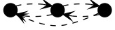
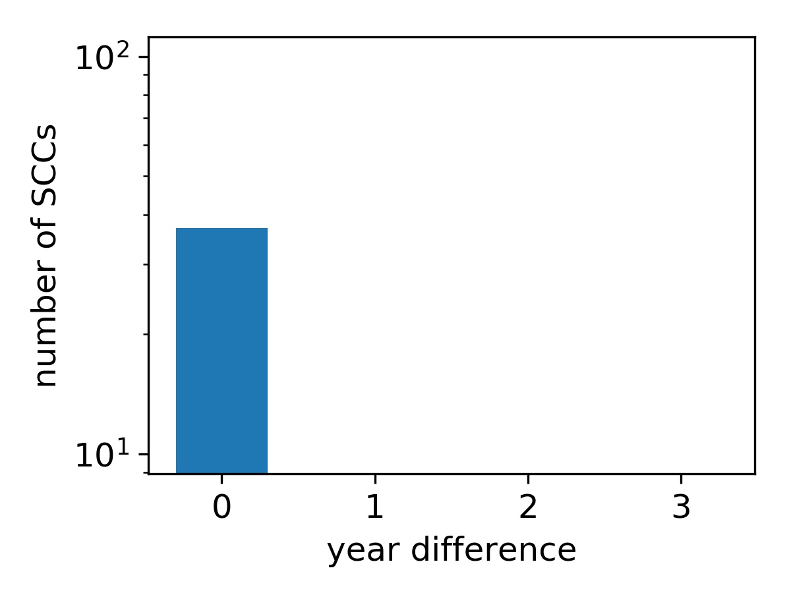
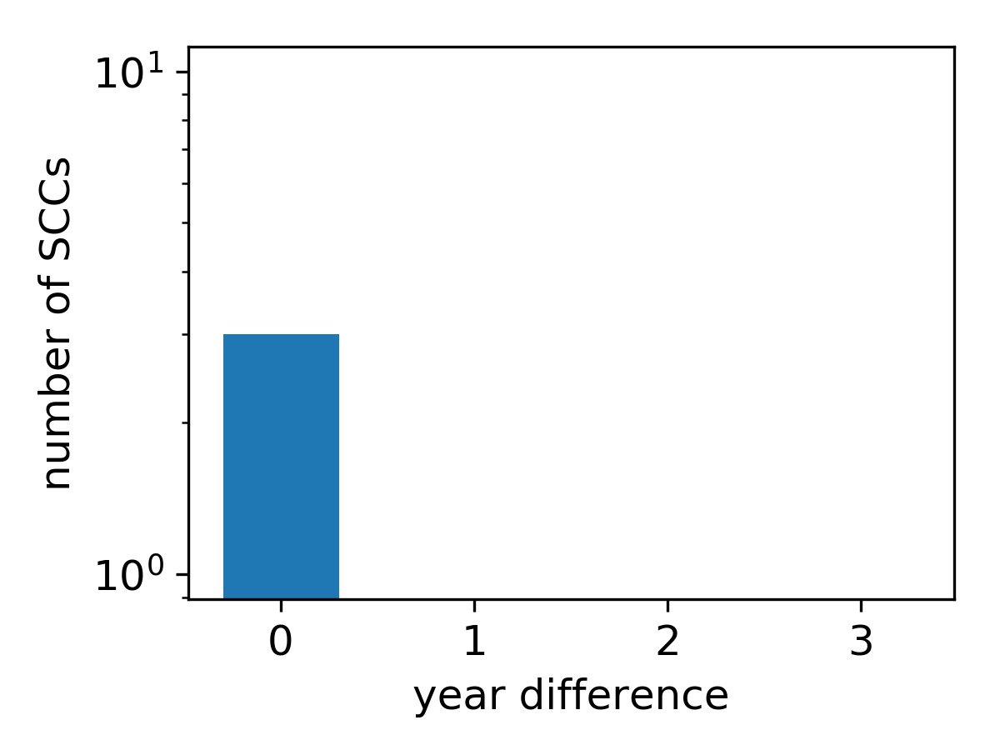
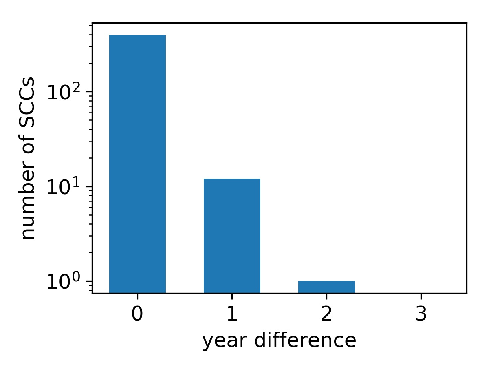
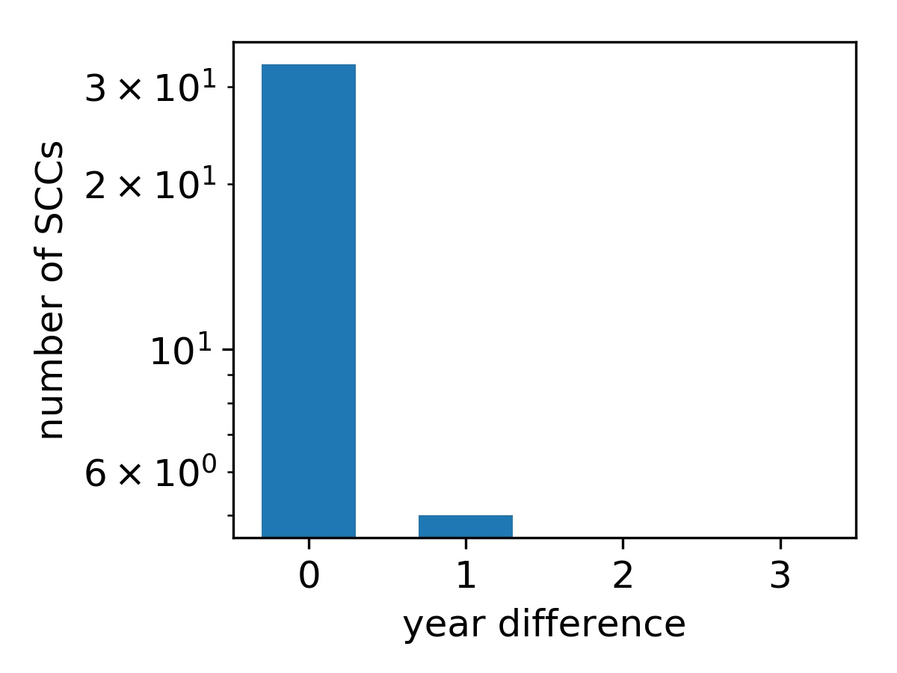
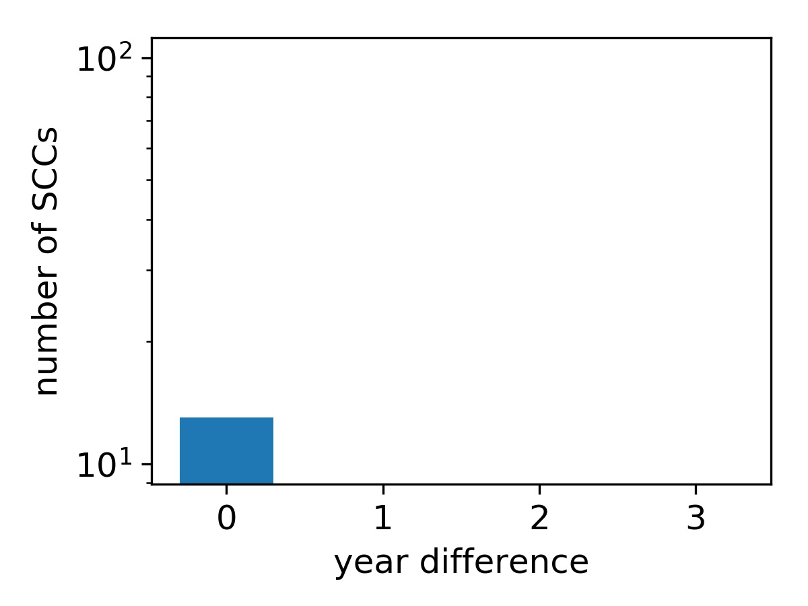
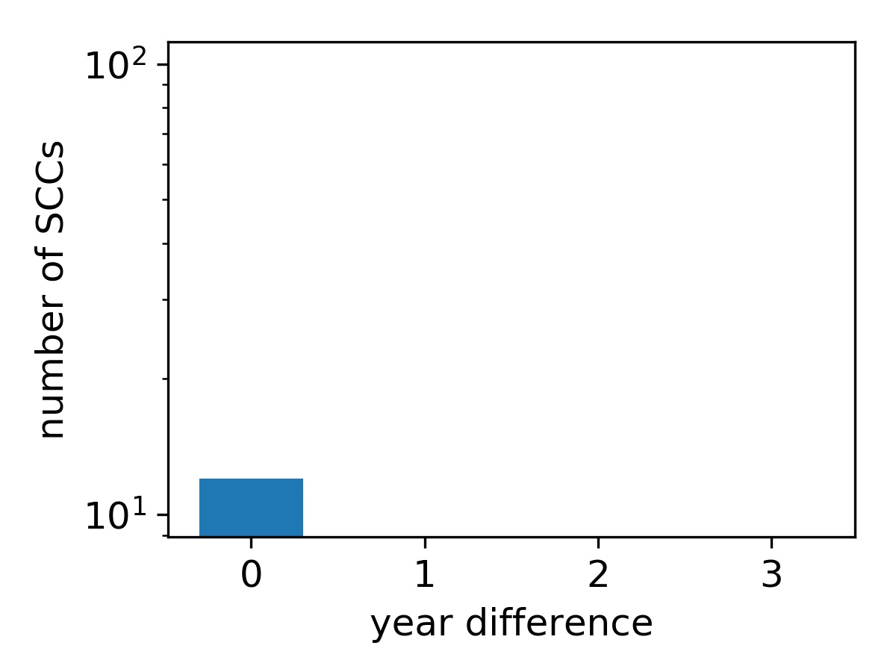
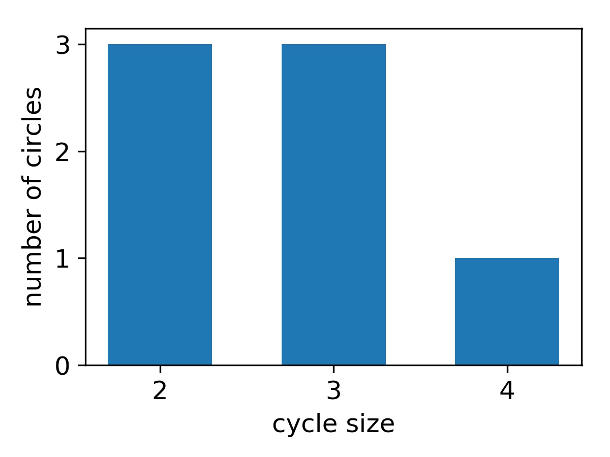
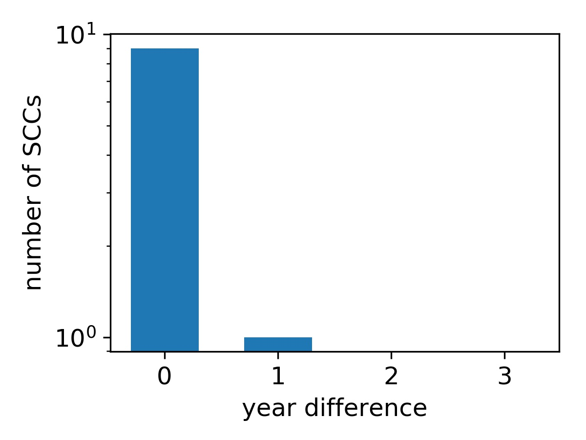
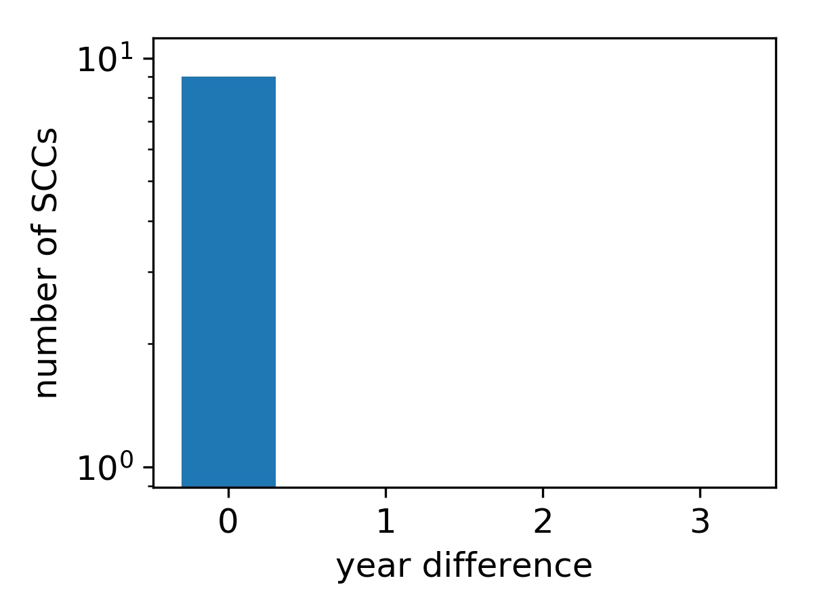

# citation_circles
Detect citation circles in citation network.

## BASIC STATISTICS
| WOS-CS|WOS-P|
| :------: | :------: |
|||

## PATTERN ANALYSIS

### WOS-CS

|index|pattern|frequency|size|year difference|circles contained|
| ------: | :------: | ------: | ------: | :------: | :------: |
|0||1379|2|||
|1||54|3|||
|2||50|3|||
|3||37|3|||
|4||17|3|||
|5||8|4|||
|6||4|4|||
|7||3|4|||
|8||3|4|||
|9||3|5|||
|10||3|4|||
|11||3|4|||
|12||3|4|||
|13||3|4|||
|14||3|3|||
|15||2|4|||
|16||2|4|||
|17||2|4|||
|18||2|4|||
|19||1|4|||

### WOS-P
|index|pattern|frequency|size|year difference|circles contained|
| ------: | :------: | ------: | ------: | :------: | :------: |
|0||22584|2|||
|1||659|3|||
|2||544|3|||
|3||409|3|||
|4||207|3|||
|5||38|3|||
|6||26|4|||
|7||26|4|||
|8||26|4|||
|9||25|4|||
|10||19|4|||
|11||15|4|||
|12||14|4|||
|13||13|4|||
|14||13|4|||
|15||12|4|||
|16||11|4|||
|17||10|4|||
|18||10|4|||
|19||9|4|||

## SOURCE ANALYSIS

analyze relationships between authors, issues, institutes of papers in one SCC. Name disambugition is not neccesary in this situation, since the author set is finite and not easy to be ambugited.

### DATA
|dataset|number of papers|with Journal|with author|with organization|
| :------: |:------: |:------: |:------: |:------: |
|WOS-CS|4011|3846|4011|2888|
|WOS-P|58315|50498|58314|38721|

### Author

#### WOS-CS
|dataset|share 1st author| share authos| not share author|
| :------:| :------: |:------: |:------: |
|WOS-CS|0.3522|0.2516|0.3962|
|WOS-P|0.3568|0.3815|0.2617|

### Issue
|dataset|share Journal | not share Journal|
| :------: | :------: | :------: |
|WOS-CS|0.001|0.999|
|WOS-P|0.011|0.989|

### Institute
|dataset|share Insti| Not share|
| :------: | :------: | :------: |
|WOS-CS|0.785|0.215|
|WOS-P|0.793|0.207|

